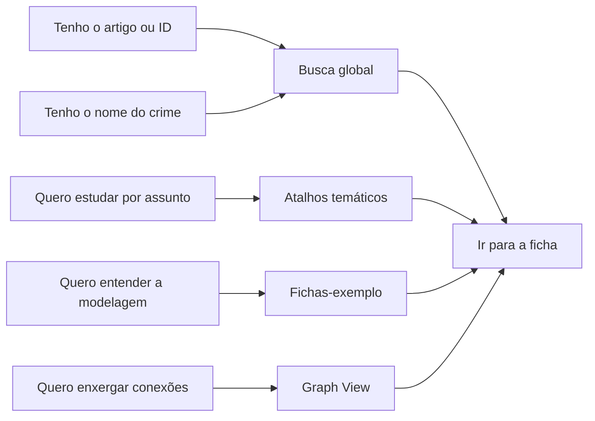
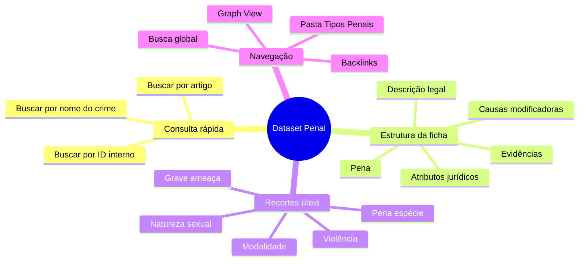

> [!abstract] Painel de entrada
> Este vault reúne **484 fichas individuais de tipos penais** do Código Penal Brasileiro em formato de consulta rápida.
> Cada ficha consolida **dispositivo**, **descrição legal**, **pena**, **atributos jurídicos**, **causas modificadoras** e **evidências textuais**.
>
> Use esta página como ponto de partida: escolha uma rota de navegação, abra um tema ou vá direto para um crime específico.

## Acesso Rápido

- **📂 Explorar o acervo**
  Abra a visão completa em [Tipos Penais](Tipos%20Penais/) para navegar por todas as fichas.
- **🔎 Buscar por artigo, nome ou ID**
  Use a busca global (`Ctrl + K` / `Cmd + K`) para encontrar `art. 155`, `estelionato` ou `CP_121_CAPUT`.
- **🧭 Entender a estrutura de uma ficha**
  Comece por [[Tipos Penais/Homicídio simples]], [[Tipos Penais/Furto]] ou [[Tipos Penais/Estupro]].
- **🕸️ Ver relações entre tipos penais**
  Use o **Graph View** para visualizar vínculos entre tipos base, derivações, qualificações e causas de aumento/diminuição.

## O Que Existe no Dataset

| Item | Visão rápida |
| :-- | :-- |
| **Granularidade** | O acervo separa caput, formas qualificadas, culposas, privilegiadas e outras derivações em fichas próprias. |
| **Cobertura da ficha** | Cada página traz descrição legal, pena mínima e máxima, atributos jurídicos e evidências extraídas da base normativa. |
| **Taxonomia útil** | O frontmatter distingue modalidades como `SIMPLES`, `DERIVADO`, `QUALIFICADO` e `CULPOSO`. |
| **Filtros materiais** | Há campos objetivos como espécie da pena, violência, grave ameaça, natureza sexual e identificador do tipo penal. |
| **Uso ideal** | Consulta rápida, revisão para concursos, comparação entre figuras típicas e exploração orientada por artigo. |

> [!tip] Leitura prática
> Se você já sabe o artigo ou o nome do crime, a busca global é o caminho mais rápido.
> Se ainda está explorando o acervo, comece pelos atalhos temáticos abaixo.

## Rotas de Navegação

## Como Ler Cada Ficha

| Bloco da ficha | Para que serve |
| :-- | :-- |
| **Descrição legal** | Mostra a redação sintética do tipo penal. |
| **Pena** | Informa espécie, mínimo, máximo e texto legal correspondente. |
| **Atributos jurídicos** | Resume violência, grave ameaça, natureza sexual, sexo exigido e outros marcadores. |
| **Causas modificadoras** | Lista aumentos, diminuições, qualificadoras, equiparações e regras correlatas quando existirem. |
| **Evidências** | Mostra os trechos normativos que sustentam a estrutura da ficha. |

> [!info] Exemplo de uso
> Para comparar crimes patrimoniais, normalmente vale olhar primeiro **descrição legal**, depois **pena**, e por fim **causas modificadoras**.
> Para crimes sexuais ou violentos, os campos de **atributos jurídicos** aceleram bastante a leitura comparativa.

## Mapa do Dataset

## Atalhos Temáticos

- **Contra a Pessoa**
  [[Tipos Penais/Homicídio simples]]  
  [[Tipos Penais/Lesão corporal]]  
  [[Tipos Penais/Feminicídio]]  
  [[Tipos Penais/Abandono de incapaz]]

- **Contra o Patrimônio**
  [[Tipos Penais/Furto]]  
  [[Tipos Penais/Roubo]]  
  [[Tipos Penais/Estelionato]]  
  [[Tipos Penais/Receptação]]

- **Dignidade Sexual**
  [[Tipos Penais/Estupro]]  
  [[Tipos Penais/Estupro de vulnerável]]  
  [[Tipos Penais/Importunação sexual]]  
  [[Tipos Penais/Assédio sexual]]

- **Fé Pública**
  [[Tipos Penais/Moeda Falsa]]  
  [[Tipos Penais/Falsificação de documento público]]  
  [[Tipos Penais/Falsificação de documento particular]]  
  [[Tipos Penais/Uso de documento falso]]

- **Administração Pública**
  [[Tipos Penais/Peculato]]  
  [[Tipos Penais/Concussão]]  
  [[Tipos Penais/Corrupção passiva]]  
  [[Tipos Penais/Prevaricação]]

- **Crimes Atuais e Tecnológicos**
  [[Tipos Penais/Fraude eletrônica]]  
  [[Tipos Penais/Invasão de dispositivo informático]]  
  [[Tipos Penais/Fraude com ativos virtuais, valores mobiliários ou ativos financeiros]]  
  [[Tipos Penais/Cessão de conta laranja]]

## Primeiros Passos Recomendados

1. Abra [Tipos Penais](Tipos%20Penais/) se quiser uma visão abrangente do acervo.
2. Use a busca global se já tiver artigo, nome do crime ou ID.
3. Visite uma ficha-exemplo para entender o padrão de modelagem.
4. Use o **Graph View** quando quiser explorar relações entre tipos próximos.

> [!success] Atalho mental
> **Busca** para encontrar.
> **Fichas-exemplo** para entender.
> **Atalhos temáticos** para estudar.
> **Graph View** para conectar.
